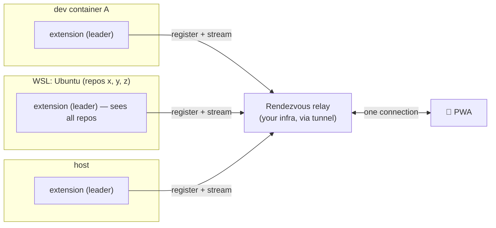

# 03 — Architecture

## Guiding split: Observer + Actuator

The research produced one clean architectural insight: the problem divides into two
halves that are solved differently.

- **Observer (read) — proven, universal, zero-config.** Tail the on-disk transcripts,
  normalize to a rich schema, stream to the phone. Detects blockers. Works for **stock**
  Copilot sessions with **no setup, no proposed API, no owning the loop**. This is the
  baseline, and it is **never gated on the actuator**.
- **Actuator (write) — optional, opt-in.** Answering/approving a session. A transcript is an
  append-only _read sink_, so answering needs a live channel _into_ the agent (you cannot
  answer by writing to a log). The proven, supported path is **Copilot Chat hooks** (below).

### The actuator is an optional upgrade — read never depends on it

CloakCode is fully useful with the observer alone: list sessions, mirror them live, and
**surface blockers on your phone** — all read-only and zero-config. Remote _answering_ is a
separate capability layered on top:

| Tier             | Setup                   | You get                                                    |
| ---------------- | ----------------------- | ---------------------------------------------------------- |
| **Baseline**     | none (reads files)      | session list · live mirror · blocker **detection**         |
| **+ Actuator**   | opt-in **Copilot hook** | remote tool **approval** (`allow`/`deny`) + real-time push |
| **+ Owned loop** | later                   | token streaming · answering multiple-choice                |

**Hook mechanism (verified 2026-07-09 by probe).** Copilot Chat runs external **hook
commands** (Claude-Code-compatible; configured in `.github/hooks/*.json`) at lifecycle/tool
boundaries. A `PreToolUse` hook receives `{ session_id, transcript_path, tool_name,
tool_input, tool_use_id }` on stdin _before_ a tool runs and returns
`permissionDecision: allow | deny`. CloakCode's hook relays the pending to the phone — routed
by `session_id`, which **equals the observer's sessionId** — and returns the human's answer:
deterministic remote approval, **no proposed API and no VS Code extension required** (the hook
is a plain command). It is **agent-agnostic** (the same contract works for Claude Code) and
registered in CloakCode's **own** file, never overwriting the user's `.claude/` config.

- _Boundary:_ hooks gate tools (`allow`/`deny`); they do **not** select an answer for a
  multiple-choice `vscode_askQuestions` — that needs the owned-loop tier.

### M3 design: the non-intrusive live-pending notifier (two channels, one subscription)

The shipping M3 actuator-precursor is a **notifier, not a gate**. Verified 2026-07-09
(docs/02 §4.6): while a blocker is _pending_, Copilot has **not** flushed its
`tool.execution_start` to the transcript — so the observer is blind to a live blocker, and the
**hook is the only real-time source**. The hook therefore emits **no `permissionDecision`**
(empty `{}`) — local VS Code drives the native prompt exactly as configured — and its only job
is to publish "this is pending" / "this resolved" for the phone.

Two channels share the **one** `session.subscribe` stream, kept deliberately distinct:

| Channel                  | Source              | Event                        | Semantics                                |
| ------------------------ | ------------------- | ---------------------------- | ---------------------------------------- |
| **History**              | transcript observer | `{kind:"event", event}`      | seq'd, append-only, `sinceSeq`-resumable |
| **Live-pending overlay** | hook spool          | `{kind:"pending", blockers}` | replace-snapshot, idempotent, no seq     |

Flow: `PreToolUse` → hook appends a `pending` line to a local spool file (localhost/fs only,
**no inbound network write** on the bridge) → the extension (the single merge point) tails the
spool, keyed by `session_id` (= observer sessionId), and pushes a `pending` snapshot. On
`PostToolUse` it drops the entry and re-pushes.

**Dedup is automatic** via the base `toolCallId` — the hook's `tool_use_id` with its
`__vscode-<n>` suffix stripped equals the transcript's `toolCallId`. The extension computes
`visible = spoolPending − transcriptToolCallIds`, so the instant an answer flushes the tool to
the transcript, the overlay drops it and it appears in **history** instead — never both at
once. The client renders history as today plus a **"Needs your input"** overlay; questions
reuse the `confirmation` part, approvals show `toolName` + command.

- **The phone is never a hard dependency.** The same card renders on the desktop localhost
  browser too; if the phone is slow, the local user answers in native VS Code and the overlay
  clears on the next snapshot. Worst case degrades to local-only — never worse than today.
- _Deferred (not M3):_ a **blocking** `PreToolUse` that returns `allow`/`deny` to resolve
  _remotely_ is possible (the hook holds synchronously up to its `timeout` — §4.5) but is a
  later tier; M3 ships read-only live awareness, not remote resolution.

### Deployment & concurrency (self-installing hook)

The extension **self-installs** its hook using paths resolved from `context` — portable across
dev container / WSL / host (each resolves to its own environment), with **no `node`-on-PATH
assumption and nothing in the workspace**:

| Piece                    | Location                          | Source                                                                                |
| ------------------------ | --------------------------------- | ------------------------------------------------------------------------------------- |
| Hook binary (bundled)    | `<extensionUri>/dist/hook.cjs`    | `context.extensionUri` (ships in the `.vsix`)                                         |
| Spool (hook writes here) | `~/.cloakcode/spool/`             | fixed per-environment dir, computed identically by hook + follower                    |
| Node runtime             | `process.execPath`                | the node running the extension host — always present                                  |
| Hook config              | `~/.copilot/hooks/cloakcode.json` | written on `activate()` (idempotent), `command = "<execPath>" "<hookBin>" PreToolUse` |

`~` in the hook config is **per-environment** (container/WSL/host each have their own
`~/.copilot/hooks`), so the extension installs once per environment where it runs.

**The spool location is a fixed convention, not a handoff.** It is `~/.cloakcode/spool` —
_not_ `globalStorageUri`. The hook config is a single **user-global** file that fires for every
window/profile in the environment, so the one spool path baked into it must be the same path
_every_ window's follower watches; a per-profile `globalStorageUri` would leave other windows
watching the wrong dir (no updates). And the hook is a **separate process** that cannot read
`context.globalStorageUri` anyway. So both sides compute the same `defaultSpoolDir()` and the
config **omits `CLOAKCODE_SPOOL` entirely** for the standard location — one source of truth,
nothing to drift. (The env var remains only as a dev-server / isolated-rig override.)

The install is gated by the `cloakcode.installHook` setting (default `true`, scope `machine` —
set in User or Remote settings, _not_ per-workspace: it controls one per-environment file shared
by every window, so a workspace override would be meaningless). It rewrites `cloakcode.json`
only when the generated content differs (idempotent), and it **regenerates to the extension's
own paths** — hand edits to that one file are replaced; other files in `~/.copilot/hooks/` are
untouched. Disabling does not delete an already-installed file. Set it to `false` to manage the
hook yourself.

**Concurrency — the spool is a directory, one file per record.** A user-global hook fires in
_every_ window of an environment, all writing the same spool. To avoid append races (POSIX
`O_APPEND` is only atomic < ~4KB, and `tool_input` can exceed that), each pending blocker is its
own file `<baseToolCallId>.json`: `PreToolUse` **writes** it, `PostToolUse` **deletes** it, so a
blocker is pending iff its file exists. Separate files = no shared-log race, no matter how many
windows fire. A missed delete can't strand a card — the transcript-subtraction dedup (the shared
`isRetired` predicate) hides it, and the follower **self-heals** by unlinking any file whose tool
has already flushed to the transcript (§4.6), so stale files can't accumulate. As a fast path,
when a session has no spool file the follower skips reading/parsing the transcript entirely.

The hook only spools **interactive** tools (the §4.6 blocker signature — `tool_name` matching
`ask/question/confirm/input/elicit`). Non-blocker tool calls (`read_file`, `grep`, …) are
skipped, so they never churn the spool or flicker a card in the overlay.

**Routing — the global spool is self-describing by `session_id`.** The spool is shared by every
session in the environment, so each record carries the Copilot `session_id` (which equals the
transcript/session id used everywhere else — proven live in M3a). A subscriber watching session
_X_ only sees records where `sessionId === X` (`computePendingBlockers` filters on it). So the
hook needs no notion of "which VS Code window" — fire-and-forget per interactive record is
sufficient; the `session_id` in the record is the correlation key the follower routes on.

_Deferred (Q6/M4):_ per-window **ephemeral bridge port** + a per-environment **leader** (lock in
globalStorage) so one observer owns the environment, and a **rendezvous relay** to unify
_different_ environments (container ↔ WSL ↔ host) for the phone. Not built until the tunnel.

### Session log source (debug-log primary, transcript fallback)

The observer reads whichever Copilot log is complete for a session (`findSessionLog`):

1. **`debug-logs/<id>/main.jsonl`** (OTel spans) — **preferred**. Complete for **both** panel-
   and editor-hosted sessions; `parseDebugLogEvents` maps `user_message` / `agent_response`
   (text + reasoning) / `tool_call` → the same `SessionPart`s as the transcript parser. Opt-in
   (`chat.chatDebug.fileLogging.enabled`), ~4s buffered flush (docs/02 §4.10).
2. **`transcripts/<id>.jsonl`** — **fallback** (zero-config). Complete for panel/agent sessions
   but records only `assistant.turn_start` for **editor-hosted** ones — hence the preference.

Both are Copilot's own **server-side** logs. VS Code's authoritative `ChatModel` (title, full
conversation, per-turn tokens/credits) is **client-side** and unreachable from the container
(docs/02 §4.11) — so these two logs are all the observer can read. The session **title** comes
from the debug-log's `title` child session (`debugLogTitle`), matching VS Code's generated
title, with the first user message as the fallback (docs/02 §4.13).

## Components

```mermaid
flowchart TB
    subgraph Local["🖥️ Local machine (trust boundary — code never leaves)"]
        subgraph VS["VS Code + @cloakcode/extension"]
            OBS["Observer\n(tails transcripts/*.jsonl)"]
            LM["Model port → vscode.lm (Copilot)"]
            AG["@cloakcode/agent\n(owned pausable loop)"]
            ACT["Actuator\n(own-loop resolve / queue-steer)"]
            BR["Bridge server\n127.0.0.1:7801 (WS, @cloakcode/protocol)"]
        end
        TR[("GitHub.copilot-chat/\ntranscripts/*.jsonl")]
        OBS -->|read-only| TR
        AG --> LM
        OBS --> BR
        AG --> BR
        ACT --> BR
    end
    BR -.->|secure tunnel (mTLS/WireGuard) — prompts + redacted context only| PH["📱 @cloakcode/web (PWA)\nsession list · live mirror · answer blockers"]
    LM -.->|consented| COP[("Copilot models")]
```

| Package                | Role                                                         | Depends on `vscode`? |
| ---------------------- | ------------------------------------------------------------ | -------------------- |
| `@cloakcode/protocol`  | `SessionPart` union + RPC schema (zod). The contract.        | No                   |
| `@cloakcode/agent`     | Pausable tool-calling + confirmation loop (pure).            | No                   |
| `@cloakcode/extension` | Model port (`vscode.lm`), observer, bridge server, actuator. | **Yes** (only here)  |
| `@cloakcode/web`       | Phone-first React/Vite PWA client.                           | No                   |

Keeping `vscode` isolated to one package makes the protocol and agent unit-testable
without an extension host.

## The core abstraction: `SessionPart`

A discriminated union both the VS Code side and the phone renderer understand — mirroring
how Copilot Chat renders typed parts:

```ts
type SessionPart =
  | {
      kind: "markdown";
      id: string;
      text: string;
      collapsible?: boolean;
      title?: string;
    }
  | { kind: "thinking"; id: string; text: string; collapsed: true }
  | {
      kind: "toolCall";
      id: string;
      name: string;
      input: unknown;
      output?: unknown;
      status: "running" | "done" | "error";
    }
  | {
      kind: "confirmation";
      id: string;
      prompt: string;
      options: Choice[];
      allowFreeform?: boolean;
    } // the blocker
  | { kind: "progress"; id: string; label: string }
  | {
      kind: "diff";
      id: string;
      path: string;
      hunks: Hunk[];
      insertions: number;
      deletions: number;
    }
  | { kind: "fileTree"; id: string; root: FileNode }
  | { kind: "codeblock"; id: string; lang: string; code: string }
  | { kind: "error"; id: string; message: string };

type Choice = {
  id: string;
  label: string;
  detail?: string;
  recommended?: boolean;
};
```

Streamed as a **sequence-numbered event log** (`append(part)`, `patch(id, delta)`,
`updateStatus(id, status)`) so a reconnecting phone resumes from `lastSeq`.

### Mapping the on-disk observer onto `SessionPart`

| Transcript event          | Becomes                                                                          |
| ------------------------- | -------------------------------------------------------------------------------- |
| `user.message`            | (turn boundary)                                                                  |
| `assistant.message`       | `markdown` (+ `thinking` from `reasoningText`)                                   |
| `tool.execution_start`    | `toolCall` status `running` — **or `confirmation`** if `toolName` is interactive |
| `tool.execution_complete` | `toolCall` → `done`/`error` (or resolves the `confirmation`)                     |

## Session state machine

`idle → running → awaiting-input → running → … → completed | failed`

`awaiting-input` = the blocker state, detected via the unmatched interactive
`tool.execution_start` signature (see research §3.2).

## Data flows

### List sessions

```text
phone → bridge {op: 'sessions.list'} → extension enumerates transcripts/*.jsonl (+ mtime liveness) → [ {id, title, turns, status, age} ]
```

### Live mirror + blocker

```mermaid
sequenceDiagram
    participant Ph as 📱 PWA
    participant BR as Bridge (WS)
    participant OB as Observer
    participant TR as transcripts/*.jsonl
    OB->>TR: tail -f
    TR-->>OB: tool.execution_start (interactive, unmatched)
    OB->>OB: state = awaiting-input; build confirmation SessionPart from arguments
    OB-->>BR: append(confirmation) + status
    BR-->>Ph: Web Push + render multiple-choice
    Ph->>BR: {op: 'session.respond', partId, choiceId}
    BR->>+Actuator: deliver answer (own-loop promise / steer-inject)
    Actuator-->>-TR: (session continues)
```

### Answer a blocker (deterministic, owned loop)

The `@cloakcode/agent` loop `await`s a promise at the confirmation point; the promise
resolves when **either** VS Code **or** the phone answers — so you can pick it up on
whichever device is nearest.

## Multi-instance topology & discovery

The extension runs in **every** VS Code instance, and a developer typically has many open
at once — across dev containers, WSL distros, and the host. `127.0.0.1` is **not** shared
across those environments, so "just bind a fixed port" both false-collides and fails to
cross namespaces. The problem is not sharing data (each observer is already whole-
environment) — it is **enumerating and routing to N independent bridges**, each labeled by
which machine/container it is.

### The grouping rule: one environment = one transcript store

All repos/windows that share **one `~/.vscode-server/data/User/`** (remote) or **one
native User dir** (local) form a single environment. This is the unit of observation:

| Scenario                                   | Same transcript store?              | Consequence                                                             |
| ------------------------------------------ | ----------------------------------- | ----------------------------------------------------------------------- |
| N repos/windows in the **same WSL distro** | **Yes** — one `~/.vscode-server`    | One observer already sees **all** repos; N activations would duplicate. |
| N repos/windows on the **host** (native)   | **Yes** — one local User dir        | Same: one observer covers all host repos.                               |
| Two **different** WSL distros              | **No** — one server dir each        | Two environments.                                                       |
| WSL **and** host together                  | **No** — server dir ≠ host User dir | Two environments.                                                       |
| Two **dev containers**                     | **No** — one server dir each        | Two environments.                                                       |

Because the observer enumerates `workspaceStorage/*/…/transcripts/*.jsonl`, it is inherently
whole-environment: **one leader per environment covers every repo in it**.

### Two-tier design

**Within an environment — single-instance leader election.** Multiple windows each activate
the extension and would each enumerate the _same_ store → duplicate sessions. Elect one
leader via a **lock file in that environment's own `globalStorage`** (scoped to the
container/distro/host — it never merges distinct environments the way `localhost` does).
Non-leaders defer and hand off their workspace info; on leader death another takes over.

**Across environments — outbound registration to a rendezvous relay.** The phone cannot
_discover_ bridges across isolated namespaces, so each environment's leader dials **out**
to CloakCode's relay (part of _your_ infra, via the existing tunnel — never GitHub) and
registers. The phone talks only to the relay, which serves the **union**. Outbound egress
works from every environment even when inbound does not, so this is uniform across dev
containers, WSL, and host, and there is **no fixed-port collision** (connections are
outbound; any optional local `127.0.0.1` bridge uses an **ephemeral** port, never a
hardcoded one as the discovery/collision mechanism).



### Instance identity (touches the M1 protocol)

Every registration and every `sessions.list` row is namespaced by a stable **instance id**,
composed from what VS Code already exposes: `vscode.env.machineId`,
`vscode.env.remoteName` (`dev-container` / `wsl` / `ssh-remote` / local), the
hostname/distro/container name, and a persisted UUID in that environment's `globalStorage`.
A session is addressed as **`(instanceId, workspaceHash, sessionId)`**, and the phone shows
a labeled list — e.g. `myrepo (dev-container) · fix-auth`, `Ubuntu (wsl) · refactor`.

The relay/tunnel itself is **M4** (YAGNI — not built early), but two cheap decisions land
in **M1** so nothing is repainted later: (1) `sessions.list` returns instance-scoped rows
and `session.subscribe` keys on `(instanceId, sessionId)`; (2) the bridge port is
configurable with an **ephemeral fallback** (`port: 0`), a fixed port being only an optional
same-host convenience.

### Endpoint modes (pluggable behind one protocol)

"Where the phone-facing endpoint lives" is a swappable choice; an instance only ever
"registers and streams," so it does not care which of these it is talking to:

| Mode                           | Endpoint lives in                              | Use                                                       |
| ------------------------------ | ---------------------------------------------- | --------------------------------------------------------- |
| **Embedded**                   | the extension host itself                      | one environment at a time; simplest, zero infra.          |
| **Self-elected local gateway** | one window per environment (owns a local port) | many windows/repos on one host or one WSL distro.         |
| **Remote gateway / mesh**      | your infra, or a WireGuard/Tailscale mesh      | many _different_ environments unified for the phone (M4). |

Because they share the same protocol + `instanceId` seam, the mode can change later without
touching the observer or the client.

### Lifetime & restart (decided)

**Decision: the bridge must NOT outlive the editor.** No detached helper, no daemon, no OS
service — an idea deliberately rejected so nothing lingers holding a port or tunnel after
you close VS Code. The lifetime contract is simply:

> **Remote access exists while ≥1 window is open on that environment, and ends cleanly when
> the last one closes.**

- **A non-leader window closes** → nothing happens (it was a follower).
- **The leader closes while others remain** → the port frees and the remaining windows
  re-elect (the same "whoever grabs the port next is host" loop); followers and the phone
  reconnect after a ~1–2 s blip.
- **The last window closes** → `deactivate()` actively disposes the WS server, releases the
  port, deregisters from any gateway, and drops the tunnel. The phone flips to
  **"environment offline"** immediately rather than hanging on a dead socket.

**Restart (the LSP-restart equivalent).** A `CloakCode: Restart Bridge` palette command (plus
an optional status-bar affordance) rebuilds the observer + server in place; a
`Restart & Re-elect Gateway` variant makes the current leader step down so the next instance
takes over; **Reload Window** is the nuclear fallback. Restarts are seamless because the phone
reconnects and **replays from `lastSeq`** — a restart looks like a brief blip, not a lost
session.

## Tech stack

| Layer     | Choice                                                 | Why                                               |
| --------- | ------------------------------------------------------ | ------------------------------------------------- |
| Extension | TypeScript + `@types/vscode`, esbuild                  | Only supported language; `vscode.lm` first-class. |
| Bridge    | Node + WebSocket (`ws`/Fastify), `127.0.0.1`           | Low overhead; localhost-only.                     |
| Protocol  | TypeScript + `zod`                                     | Boundary validation; shared types.                |
| Client    | React + Vite PWA, Shiki, `react-markdown`              | Phone-first, installable, rich rendering.         |
| Push      | Service worker + Web Push API                          | Blocker alerts to a backgrounded phone.           |
| Tunnel    | WireGuard / SSH reverse forward / mTLS to _your_ infra | Never GitHub.                                     |
| Packaging | `@vscode/vsce` (private/internal)                      | Enterprise-restricted distribution.               |

## Client ordering

1. **PWA mirror + session list first** (rides the proven observer — immediate value).
2. **Actuator** (answer/steer) second — the real remaining engineering.
