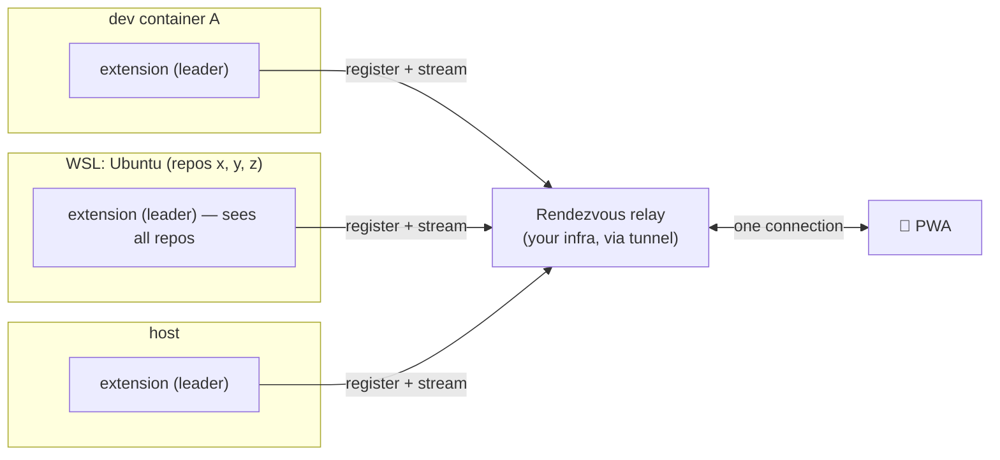
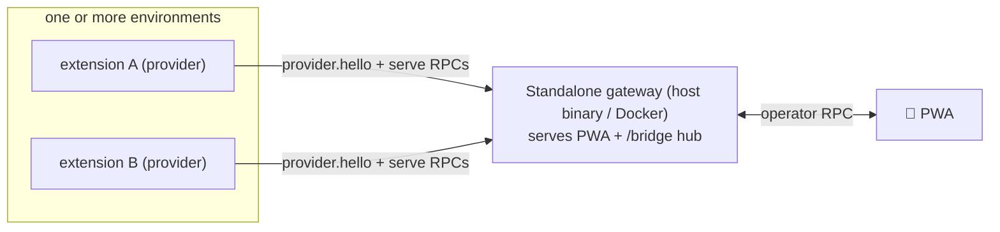

# 03 — Architecture

## Guiding split: Observer + Actuator

The research produced one clean architectural insight: the problem divides into two
halves that are solved differently.

- **Observer (read) — proven, universal, zero-config.** Tail the on-disk transcripts,
  normalize to a rich schema, stream to the phone. Detects blockers. Works for **stock**
  Copilot sessions with **no setup, no proposed API, no owning the loop**. This is the
  baseline, and it is **never gated on the actuator**.
- **Actuator (write) — optional, opt-in.** Answering/approving a session. A transcript is an
  append-only _read sink_, so answering needs a live channel _into_ the agent (you cannot
  answer by writing to a log). The proven, supported path is **Copilot Chat hooks** (below).

### The actuator is an optional upgrade — read never depends on it

CloakCode is fully useful with the observer alone: list sessions, mirror them live, and
**surface blockers on your phone** — all read-only and zero-config. Remote _answering_ is a
separate capability layered on top:

| Tier             | Setup                   | You get                                                    |
| ---------------- | ----------------------- | ---------------------------------------------------------- |
| **Baseline**     | none (reads files)      | session list · live mirror · blocker **detection**         |
| **+ Actuator**   | opt-in **Copilot hook** | remote tool **approval** (`allow`/`deny`) + real-time push |
| **+ Owned loop** | later                   | token streaming · answering multiple-choice                |

**Hook mechanism (verified 2026-07-09 by probe).** Copilot Chat runs external **hook
commands** (Claude-Code-compatible; configured in `.github/hooks/*.json`) at lifecycle/tool
boundaries. A `PreToolUse` hook receives `{ session_id, transcript_path, tool_name,
tool_input, tool_use_id }` on stdin _before_ a tool runs and returns
`permissionDecision: allow | deny`. CloakCode's hook relays the pending to the phone — routed
by `session_id`, which **equals the observer's sessionId** — and returns the human's answer:
deterministic remote approval, **no proposed API and no VS Code extension required** (the hook
is a plain command). It is **agent-agnostic** (the same contract works for Claude Code) and
registered in CloakCode's **own** file, never overwriting the user's `.claude/` config.

- _Boundary:_ hooks gate tools (`allow`/`deny`); they do **not** select an answer for a
  multiple-choice `vscode_askQuestions` — that needs the owned-loop tier.

### M3 design: the non-intrusive live-pending notifier (two channels, one subscription)

The shipping M3 actuator-precursor is a **notifier, not a gate**. Verified 2026-07-09
(docs/02 §4.6): while a blocker is _pending_, Copilot has **not** flushed its
`tool.execution_start` to the transcript — so the observer is blind to a live blocker, and the
**hook is the only real-time source**. The hook therefore emits **no `permissionDecision`**
(empty `{}`) — local VS Code drives the native prompt exactly as configured — and its only job
is to publish "this is pending" / "this resolved" for the phone.

Two channels share the **one** `session.subscribe` stream, kept deliberately distinct:

| Channel                  | Source              | Event                        | Semantics                                |
| ------------------------ | ------------------- | ---------------------------- | ---------------------------------------- |
| **History**              | transcript observer | `{kind:"event", event}`      | seq'd, append-only, `sinceSeq`-resumable |
| **Live-pending overlay** | hook spool          | `{kind:"pending", blockers}` | replace-snapshot, idempotent, no seq     |

Flow: `PreToolUse` → hook appends a `pending` line to a local spool file (localhost/fs only,
**no inbound network write** on the bridge) → the extension (the single merge point) tails the
spool, keyed by `session_id` (= observer sessionId), and pushes a `pending` snapshot. On
`PostToolUse` it drops the entry and re-pushes.

**Dedup is automatic** via the base `toolCallId` — the hook's `tool_use_id` with its
`__vscode-<n>` suffix stripped equals the transcript's `toolCallId`. The extension computes
`visible = spoolPending − transcriptToolCallIds`, so the instant an answer flushes the tool to
the transcript, the overlay drops it and it appears in **history** instead — never both at
once. The client renders history as today plus a **"Needs your input"** overlay; questions
reuse the `confirmation` part, approvals show `toolName` + command.

- **The phone is never a hard dependency.** The same card renders on the desktop localhost
  browser too; if the phone is slow, the local user answers in native VS Code and the overlay
  clears on the next snapshot. Worst case degrades to local-only — never worse than today.
- **Now built — remote approval (surface + debounce), below.** Remote resolution upgrades the
  notifier; it needs no take-control and never blocks a tool.

### Remote approval (surface + debounce)

Remote **approval** upgrades the notifier from read-only awareness to remote resolution without
re-implementing VS Code’s approval engine (docs/02 §4.20). The `PreToolUse` hook fires for
**every** tool call _before_ VS Code’s own decision, so it cannot know which calls will actually
prompt — and it no longer tries to. It **surfaces every call** and defers; whatever resolves the
call (the local user, VS Code auto-approve, or the remote operator) makes it complete and the
observer retires the card. There is **no take-control toggle and no permission replication** — the
earlier design (docs/02 §4.15/§4.16) is superseded.

- **Surface, never block.** `PreToolUse` records the call (`spoolRecordFor`) and returns `{}` — VS
  Code’s own approval UI is untouched. An interactive `ask`/`confirm`/… tool becomes a **question**
  (answered structurally); everything else an **approval** (`awaitingDecision`, rendered Allow/Deny).
- **Resolve by command.** `session.decide {toolCallId, decision}` fires VS Code’s own
  `workbench.action.chat.acceptTool` (allow) / `skipTool` (deny), targeted by the session URI
  `vscode-chat-session://local/<base64url(sessionId)>` (`localChatSessionUri`). VS Code matches the
  widget by **exact** URI equality, so a wrong/stale id is a safe no-op — it can never resolve a
  different session (docs/02 §4.20). Questions resolve via `session.answer` →
  `_chat.notifyQuestionCarouselAnswer` (docs/02 §4.16/§4.17).
- **Debounce surfacing (anti-flicker).** Because the hook fires before VS Code decides, an
  auto-approved call would briefly show then vanish. The observer **debounces** surfacing by
  `cloakcode.surfaceDebounceMs` (default **3 s**): a call VS Code auto-approves/answers within the
  window is retired (its id lands in the transcript, or a later turn supersedes it) before it ever
  shows. Applies to both questions and approvals. A _slow_ auto-approved tool can’t be told apart
  from a waiting one on disk (the §4.6 lag), so it shows a transient card until it completes —
  non-harmful (its buttons no-op); the client carries a standing disclaimer that a call may already
  be auto-resolved.
- **Orphan cleanup (causal).** A card whose tool call has **no end** (the turn was cancelled or the
  window closed before `PostToolUse`) is retired once the transcript shows a **later turn** than the
  record (`isSuperseded`; docs/02 §4.19) — causal, not a timer, and safe for a live blocker (the
  transcript lags the in-flight turn). This replaces the old reset-on-restart.

### Deployment & concurrency (self-installing hook)

The extension **self-installs** its hook using paths resolved from `context` — portable across
dev container / WSL / host (each resolves to its own environment), with **no `node`-on-PATH
assumption and nothing in the workspace**:

| Piece                    | Location                          | Source                                                                                |
| ------------------------ | --------------------------------- | ------------------------------------------------------------------------------------- |
| Hook binary (bundled)    | `<extensionUri>/dist/hook.cjs`    | `context.extensionUri` (ships in the `.vsix`)                                         |
| Spool (hook writes here) | `~/.cloakcode/spool/`             | fixed per-environment dir, computed identically by hook + follower                    |
| Node runtime             | `process.execPath`                | the node running the extension host — always present                                  |
| Hook config              | `~/.copilot/hooks/cloakcode.json` | written on `activate()` (idempotent), `command = "<execPath>" "<hookBin>" PreToolUse` |

`~` in the hook config is **per-environment** (container/WSL/host each have their own
`~/.copilot/hooks`), so the extension installs once per environment where it runs.

**The spool location is a fixed convention, not a handoff.** It is `~/.cloakcode/spool` —
_not_ `globalStorageUri`. The hook config is a single **user-global** file that fires for every
window/profile in the environment, so the one spool path baked into it must be the same path
_every_ window's follower watches; a per-profile `globalStorageUri` would leave other windows
watching the wrong dir (no updates). And the hook is a **separate process** that cannot read
`context.globalStorageUri` anyway. So both sides compute the same `defaultSpoolDir()` and the
config **omits `CLOAKCODE_SPOOL` entirely** for the standard location — one source of truth,
nothing to drift. (The env var remains only as a dev-server / isolated-rig override.)

The install is gated by the `cloakcode.installHook` setting (default `true`, scope `machine` —
set in User or Remote settings, _not_ per-workspace: it controls one per-environment file shared
by every window, so a workspace override would be meaningless). It rewrites `cloakcode.json`
only when the generated content differs (idempotent), and it **regenerates to the extension's
own paths** — hand edits to that one file are replaced; other files in `~/.copilot/hooks/` are
untouched. Disabling does not delete an already-installed file. Set it to `false` to manage the
hook yourself.

**Concurrency — the spool is a directory, one file per record.** A user-global hook fires in
_every_ window of an environment, all writing the same spool. To avoid append races (POSIX
`O_APPEND` is only atomic < ~4KB, and `tool_input` can exceed that), each pending blocker is its
own file `<baseToolCallId>.json`: `PreToolUse` **writes** it, `PostToolUse` **deletes** it, so a
blocker is pending iff its file exists. Separate files = no shared-log race, no matter how many
windows fire. A missed delete can't strand a card — the transcript-subtraction dedup (the shared
`isRetired` predicate) hides it, and the follower **self-heals** by unlinking any file whose tool
has already flushed to the transcript (§4.6), so stale files can't accumulate. As a fast path,
when a session has no spool file the follower skips reading/parsing the transcript entirely.

The hook spools **every** tool call (`spoolRecordFor` — interactive tools as questions, the rest
as `awaitingDecision` approvals), since it runs before VS Code’s approve/confirm decision and
can’t know which will prompt. The **debounce** (docs/02 §4.20) means an auto-approved call is
retired before it ever surfaces, so this doesn’t flicker the overlay despite the extra churn; the
fast path still skips the transcript parse when a session has no spool file.

**Routing — the global spool is self-describing by `session_id`.** The spool is shared by every
session in the environment, so each record carries the Copilot `session_id` (which equals the
transcript/session id used everywhere else — proven live in M3a). A subscriber watching session
_X_ only sees records where `sessionId === X` (`computePendingBlockers` filters on it). So the
hook needs no notion of "which VS Code window" — fire-and-forget per interactive record is
sufficient; the `session_id` in the record is the correlation key the follower routes on.

The per-window **ephemeral bridge port** is now the default (`cloakcode.port: 0` picks a free
port; set a fixed port to lock the phone/tunnel URL), and `instanceId` defaults to
`<env-kind>:<workspace>` (dev-container name when available; `cloakcode.instanceId` overrides
per workspace). _Deferred (Q6/M4):_ a per-environment **leader** (lock in globalStorage) so one
observer owns the environment, and a **rendezvous relay** to unify _different_ environments
(container ↔ WSL ↔ host) for the phone. Not built until the tunnel.

### Session log source (debug-log primary, transcript fallback)

The observer reads whichever Copilot log is complete for a session (`findSessionLog`):

1. **`debug-logs/<id>/main.jsonl`** (OTel spans) — **preferred**. Complete for **both** panel-
   and editor-hosted sessions; `parseDebugLogEvents` maps `user_message` / `agent_response`
   (text + reasoning) / `tool_call` → the same `SessionPart`s as the transcript parser. Opt-in
   (`github.copilot.chat.agentDebugLog.fileLogging.enabled`, experiment-gated; docs/02 §4.25),
   ~4s buffered flush.
2. **`transcripts/<id>.jsonl`** — **fallback** (zero-config). Complete for panel/agent sessions
   but records only `assistant.turn_start` for **editor-hosted** ones — hence the preference.

Both are Copilot's own **server-side** logs. VS Code's authoritative `ChatModel` (title, full
conversation, per-turn tokens/credits) is **client-side** and unreachable from the container
(docs/02 §4.11) — so these two logs are all the observer can read. The session **title** comes
from the debug-log's `title` child session (`debugLogTitle`), matching VS Code's generated
title, with the first user message as the fallback (docs/02 §4.13).

## Components

```mermaid
flowchart TB
    subgraph Local["🖥️ Local machine (trust boundary — code never leaves)"]
        subgraph VS["VS Code + @cloakcode/extension"]
            OBS["Observer\n(tails transcripts/*.jsonl)"]
            LM["Model port → vscode.lm (Copilot)"]
            AG["@cloakcode/agent\n(owned pausable loop)"]
            ACT["Actuator\n(own-loop resolve / queue-steer)"]
            BR["Bridge server\n127.0.0.1:7801 (WS, @cloakcode/protocol)"]
        end
        TR[("GitHub.copilot-chat/\ntranscripts/*.jsonl")]
        OBS -->|read-only| TR
        AG --> LM
        OBS --> BR
        AG --> BR
        ACT --> BR
    end
    BR -.->|secure tunnel (mTLS/WireGuard) — prompts + redacted context only| PH["📱 @cloakcode/web (PWA)\nsession list · live mirror · answer blockers"]
    LM -.->|consented| COP[("Copilot models")]
```

| Package                | Role                                                         | Depends on `vscode`? |
| ---------------------- | ------------------------------------------------------------ | -------------------- |
| `@cloakcode/protocol`  | `SessionPart` union + RPC schema (zod). The contract.        | No                   |
| `@cloakcode/agent`     | Pausable tool-calling + confirmation loop (pure).            | No                   |
| `@cloakcode/extension` | Model port (`vscode.lm`), observer, bridge server, actuator. | **Yes** (only here)  |
| `@cloakcode/web`       | Phone-first React/Vite PWA client.                           | No                   |

Keeping `vscode` isolated to one package makes the protocol and agent unit-testable
without an extension host.

### The gateway (one port serves the PWA + `/bridge`)

In dev, Vite serves the PWA and proxies `/bridge` to the bridge. Packaged, there is no Vite:
the extension's bridge **is** an `http.createServer` that serves the **built PWA**
(`<extensionUri>/dist/web`, bundled in the `.vsix`) on plain GETs and **upgrades `/bridge`** to
the same WebSocket — so one tunnelled `127.0.0.1` port carries both the app and the live stream
(the client already talks **same-origin `/bridge`**). Static serving is optional (`serveDir`):
without it (dev/test) the server answers plain HTTP with `426` and stays WS-only, so nothing
changes for the dev-server or the bridge tests. The single path-safety check (traversal /
null-byte / percent-decode) lives in the pure `resolveStaticPath` (`static-files.ts`),
unit-tested without a filesystem. Reaching the phone is a separate concern (`asExternalUri` + QR
in cloud remotes; your Dev Tunnel locally) — the gateway itself only binds loopback.
The `CloakCode: Show Phone Link` command resolves the URL in priority order —
`cloakcode.publicUrl` → an **auto-hosted private Dev Tunnel** (`cloakcode.tunnel:
devtunnel`, which spawns `devtunnel host` and scrapes the URL, no manual step) →
`asExternalUri` — and shows a scannable **QR** (a tiny zero-dep encoder → inline SVG in a
webview, so there's no rasterization and ~0 runtime weight beyond the encoder). In a
**local dev container** `asExternalUri` returns a desktop-loopback URL (VS Code forwards
to the desktop, not a public tunnel); use `cloakcode.tunnel: devtunnel`, or forward the
port **Public** (Ports view) / run a tunnel and set `cloakcode.publicUrl`. The command
warns when the resolved URL is still loopback. **`CloakCode: Set Up Phone Tunnel`**
(re)establishes the Dev Tunnel and, on failure, offers a confirmation-based CLI install
or a sign-in flow picker (GitHub / Microsoft × browser / device-code) — device-code for
containers/remote where a local browser can't open. In **gateway (client) mode** the extension
runs no bridge of its own — the hub owns the tunnel and **pushes its phone URL down** (a
`gateway.info` control frame), so **Show Phone Link** renders the gateway's URL and **Set Up Phone
Tunnel** points you at the hub instead.

**Two deployment modes (same server, two homes).** **Embedded is the default:** with no
configuration the extension serves its own environment's PWA + `/bridge` (what ships today) — a
self-sufficient, single-environment gateway. Opt in to the **standalone gateway** by setting
`cloakcode.gatewayUrl`: the extension then serves nothing itself and connects out as a
**provider** to the hub you run. Both modes run the _same_ `startBridge` / `serveDir` server — the
standalone gateway is that server extracted to its own process (host binary / Docker), extended to
accept provider connections — so surfacing the webapp from the extension and from the hub is one
code path, not two. See “Explicit gateway (MVP)” under Multi-instance topology.

## The core abstraction: `SessionPart`

A discriminated union both the VS Code side and the phone renderer understand — mirroring
how Copilot Chat renders typed parts:

```ts
type SessionPart =
  | {
      kind: "markdown";
      id: string;
      text: string;
      collapsible?: boolean;
      title?: string;
    }
  | { kind: "thinking"; id: string; text: string; collapsed: true }
  | {
      kind: "toolCall";
      id: string;
      name: string;
      input: unknown;
      output?: unknown;
      status: "running" | "done" | "error";
    }
  | {
      kind: "confirmation";
      id: string;
      prompt: string;
      options: Choice[];
      allowFreeform?: boolean;
    } // the blocker
  | { kind: "progress"; id: string; label: string }
  | {
      kind: "diff";
      id: string;
      path: string;
      hunks: Hunk[];
      insertions: number;
      deletions: number;
    }
  | { kind: "fileTree"; id: string; root: FileNode }
  | { kind: "codeblock"; id: string; lang: string; code: string }
  | { kind: "error"; id: string; message: string };

type Choice = {
  id: string;
  label: string;
  detail?: string;
  recommended?: boolean;
};
```

Streamed as a **sequence-numbered event log** (`append(part)`, `patch(id, delta)`,
`updateStatus(id, status)`) so a reconnecting phone resumes from `lastSeq`.

### Rendering a long backlog (keep the open O(n))

Opening a session replays its **whole backlog** — the observer's `SessionFollower`
emits one event per record, and stitch (above) makes that backlog as long as the
transcript. The client must therefore treat the open as O(n), not O(n²):

- **Coalesce, don't render per event.** `@cloakcode/web` buffers incoming events and
  applies **one batch per animation frame** (`applyEvents`), so the parts array —
  and the reflow/auto-scroll — rebuilds once per frame, not once per event.
- **Memoize parts.** `Part` and `Markdown` are `React.memo`'d (with hoisted
  react-markdown plugins/components), so a streamed append never re-parses the
  markdown of the earlier parts. Parsing is the hot path; this is what keeps it O(n).

Don't reintroduce per-event `dispatch`, a per-render markdown `components` object, or
an un-memoized part — any one silently restores the O(n²) open on long transcripts.

### Mapping the on-disk observer onto `SessionPart`

| Transcript event          | Becomes                                                                          |
| ------------------------- | -------------------------------------------------------------------------------- |
| `user.message`            | (turn boundary)                                                                  |
| `assistant.message`       | `markdown` (+ `thinking` from `reasoningText`)                                   |
| `tool.execution_start`    | `toolCall` status `running` — **or `confirmation`** if `toolName` is interactive |
| `tool.execution_complete` | `toolCall` → `done`/`error` (or resolves the `confirmation`)                     |

## Session state machine

`idle → running → awaiting-input → running → … → completed | failed`

`awaiting-input` = the blocker state, detected via the unmatched interactive
`tool.execution_start` signature (see research §3.2).

### Derived session activity (client header phrase)

The scan status (`active` / `blocked` / `idle`) lags a live turn, so the session
header derives a sharper "what's happening now" phrase from the live-pending overlay
plus the mirrored parts (`@cloakcode/web` `sessionActivity`) — no new event type, no
extra egress:

| Condition (first match wins)                                               | Phrase                | Awaiting operator? |
| -------------------------------------------------------------------------- | --------------------- | ------------------ |
| pending blocker with raw `input` and no `confirmations`                    | `blocked on approval` | yes (amber)        |
| pending blocker with `confirmations`, or an unresolved `confirmation` part | `awaiting response`   | yes (amber)        |
| a `toolCall` part currently `running`                                      | `tool calling`        | no                 |
| otherwise                                                                  | the scan status word  | `blocked` → amber  |

The returned `awaiting` bit drives the amber indicator; every phrase is derived
purely from data the observer already streams (no new `SessionPart`, no new RPC).

## Data flows

### List sessions

```text
phone → bridge {op: 'sessions.list'} → extension enumerates transcripts/*.jsonl (+ mtime liveness) → [ {id, title, turns, status, age} ]
```

### Live mirror + blocker

```mermaid
sequenceDiagram
    participant Ph as 📱 PWA
    participant BR as Bridge (WS)
    participant OB as Observer
    participant TR as transcripts/*.jsonl
    OB->>TR: tail -f
    TR-->>OB: tool.execution_start (interactive, unmatched)
    OB->>OB: state = awaiting-input; build confirmation SessionPart from arguments
    OB-->>BR: append(confirmation) + status
    BR-->>Ph: Web Push + render multiple-choice
    Ph->>BR: {op: 'session.respond', partId, choiceId}
    BR->>+Actuator: deliver answer (own-loop promise / steer-inject)
    Actuator-->>-TR: (session continues)
```

### Answer a blocker (deterministic, owned loop)

The `@cloakcode/agent` loop `await`s a promise at the confirmation point; the promise
resolves when **either** VS Code **or** the phone answers — so you can pick it up on
whichever device is nearest.

## Multi-instance topology & discovery

The extension runs in **every** VS Code instance, and a developer typically has many open
at once — across dev containers, WSL distros, and the host. `127.0.0.1` is **not** shared
across those environments, so "just bind a fixed port" both false-collides and fails to
cross namespaces. The problem is not sharing data (each observer is already whole-
environment) — it is **enumerating and routing to N independent bridges**, each labeled by
which machine/container it is.

### The grouping rule: one environment = one transcript store

All repos/windows that share **one `~/.vscode-server/data/User/`** (remote) or **one
native User dir** (local) form a single environment. This is the unit of observation:

| Scenario                                   | Same transcript store?              | Consequence                                                             |
| ------------------------------------------ | ----------------------------------- | ----------------------------------------------------------------------- |
| N repos/windows in the **same WSL distro** | **Yes** — one `~/.vscode-server`    | One observer already sees **all** repos; N activations would duplicate. |
| N repos/windows on the **host** (native)   | **Yes** — one local User dir        | Same: one observer covers all host repos.                               |
| Two **different** WSL distros              | **No** — one server dir each        | Two environments.                                                       |
| WSL **and** host together                  | **No** — server dir ≠ host User dir | Two environments.                                                       |
| Two **dev containers**                     | **No** — one server dir each        | Two environments.                                                       |

Because the observer enumerates `workspaceStorage/*/…/transcripts/*.jsonl`, it is inherently
whole-environment: **one leader per environment covers every repo in it**.

### Two-tier design

**Within an environment — single-instance leader election.** Multiple windows each activate
the extension and would each enumerate the _same_ store → duplicate sessions. Elect one
leader via a **lock file in that environment's own `globalStorage`** (scoped to the
container/distro/host — it never merges distinct environments the way `localhost` does).
Non-leaders defer and hand off their workspace info; on leader death another takes over.

**Across environments — outbound registration to a rendezvous relay.** The phone cannot
_discover_ bridges across isolated namespaces, so each environment's leader dials **out**
to CloakCode's relay (part of _your_ infra, via the existing tunnel — never GitHub) and
registers. The phone talks only to the relay, which serves the **union**. Outbound egress
works from every environment even when inbound does not, so this is uniform across dev
containers, WSL, and host, and there is **no fixed-port collision** (connections are
outbound; any optional local `127.0.0.1` bridge uses an **ephemeral** port, never a
hardcoded one as the discovery/collision mechanism).



### Explicit gateway (MVP): the hub you run

The relay above assumes **auto** leader election + auto discovery. For the MVP we make the leader
**explicit** and ship the hub as a **standalone artifact** you run yourself — a plain Node process
(or a **Docker image**) that is the relay: it serves the **PWA** and accepts WebSocket
connections, and it holds **no `vscode`** (it extends the existing `dev-server` seam — the bridge
is already `vscode`-free, with the actuator injected as callbacks).

Two connection **roles** share the one `/bridge` endpoint, distinguished by a first frame:

- **operator** (the phone / PWA) — speaks the existing client RPC (`sessions.list`,
  `session.subscribe|respond|decide|answer`), unchanged.
- **provider** (an extension in client mode) — dials **out** to the gateway and registers with a
  `provider.hello { instanceId, … }`, then serves the gateway's forwarded RPCs for its own
  sessions (observer + actuator — which is why the provider stays in the extension host).

**Unset (the default) → embedded:** the extension serves its own PWA + `/bridge` and needs no hub.
When `cloakcode.gatewayUrl` is set (scope **machine / user / workspace** — a reachable hub is
usually a per-machine fact, overridable per workspace) and the hub is reachable, the extension
**does not** start its own bridge or serve the PWA — it connects as a **provider** and speaks
**only the protocol**. The leader is whoever you pointed the extensions at, so **N extensions in
one environment all register with the one gateway** and it de-dupes. If the configured hub is
**unreachable**, the extension **falls back to embedded** so you're never locked out — surfacing
the webapp locally is always available.

**Routing + de-dup.** The gateway keeps a `Map<instanceId, provider>`. `sessions.list` fans out
to every provider and returns the **union, de-duped by `(instanceId, sessionId)`** (preferring the
`owned` provider); session-addressed RPCs (`subscribe/respond/decide/answer`, which already carry
`instanceId`) route to that instance's provider and relay its frames. The protocol needs nothing
new for addressing — only the `provider.hello` registration envelope.

**Phone link + connect URLs.** The gateway owns the phone tunnel, so it **pushes its phone URL to
each provider** as a `gateway.info` control frame (on connect and whenever it changes) — an
extension in client mode renders that for **Show Phone Link** instead of a bridge it doesn't run.
On startup the runner also **probes the host's network interfaces and prints the ranked
`cloakcode.gatewayUrl` candidates** (loopback → each LAN/virtual IP → a `host.docker.internal`
hint) so you can pick the one matching where each extension runs.

**Deferred (post-MVP):** **auto** leader election _within_ an environment (the `globalStorage`
lock above) and auto-discovery of the hub. Until then, explicit `cloakcode.gatewayUrl` + gateway
de-dup cover multiple extensions per environment.



### Instance identity (touches the M1 protocol)

Every registration and every `sessions.list` row is namespaced by a stable **instance id**,
composed from what VS Code already exposes: `vscode.env.machineId`,
`vscode.env.remoteName` (`dev-container` / `wsl` / `ssh-remote` / local), the
hostname/distro/container name, and a persisted UUID in that environment's `globalStorage`.
A session is addressed as **`(instanceId, workspaceHash, sessionId)`**, and the phone shows
a labeled list — e.g. `myrepo (dev-container) · fix-auth`, `Ubuntu (wsl) · refactor`.

The relay/tunnel itself is **M4** (YAGNI — not built early), but two cheap decisions land
in **M1** so nothing is repainted later: (1) `sessions.list` returns instance-scoped rows
and `session.subscribe` keys on `(instanceId, sessionId)`; (2) the bridge port is
configurable with an **ephemeral fallback** (`port: 0`), a fixed port being only an optional
same-host convenience.

### Actuation routing & the receiving-side guard (owned vs read-only)

Observation is whole-environment (the leader enumerates **every** repo's
`transcripts/*.jsonl`), but **actuation is workspace-scoped**: a session is only safely
driveable from the window/environment that actually hosts it. Opening a foreign session
_by URI_ from another window takes VS Code's **load/restore** path (a skeletal copy) rather
than the live **acquire** path, and mis-targets — in testing a remote answer round-tripped
into a brand-new session under the wrong `workspaceHash`
(see [docs/02 §4.10](02-research-findings.md) and the cross-window mis-target correction).

So the address triple `(instanceId, workspaceHash, sessionId)` carries an ownership bit:

- **`owned` (shipped, M1).** `sessions.list` stamps every row with `owned: boolean`, true
  iff a live extension serves that session's workspace (computed from the activating
  window's `context.storageUri` hash). The list still shows **all** sessions in the
  environment; the client renders foreign ones **locked / read-only** — navigable to view
  the transcript, but with the composer and every blocker action (send / answer / approve)
  removed, and owned groups labeled with their instance name. **Today this is UI-side
  gating only** — the bridge is a pure proxy with no routing logic, which is fine while a
  single environment is embedded.

- **Router + receiving-side guard (deferred — required before the bridge is more than a
  proxy).** Once the bridge becomes the self-elected **gateway** or the M4 **relay / leader**
  serving multiple environments, UI gating is not enough. Two enforcement points must exist:
  1. **Route, don't broadcast.** The gateway dispatches each action (`respond` / `decide` /
     `answer`) to the one extension that owns `(instanceId, workspaceHash)` — never to the
     focused window or by fan-out.
  2. **Guard at the receiver (defense in depth).** The receiving extension MUST verify the
     action's `(workspaceHash, sessionId)` matches a session it actually hosts and
     **ignore / reject** it otherwise. It must **never** acquire-or-load a foreign session by
     URI to satisfy a misrouted action — that is precisely the mis-target above. The
     `remote-operator` provenance tag is checked at the same gate.

  The UI `owned` flag is correctness for the honest path; the router plus the receiver guard
  are the **security boundary** once actions can arrive for a workspace this window does not
  own.

### Diagnostics dump (`cloakcode.showDiagnostics`)

Ownership resolving to "everything read-only" is hard to debug blind — the root cause
once was an extension id containing a slash breaking the storage-hash derivation (see the
[docs/02](02-research-findings.md) corrections log). The **Show Diagnostics** command
prints a snapshot to the `CloakCode` output channel (activation also dumps it there, and to
`CLOAKCODE_DIAG_FILE` when set — the dev launch points it at `.local/cloakcode-diagnostics.txt`).
It is **redaction-safe**: no secrets, tokens, code, or prompts — only environment metadata
and the `CLOAKCODE_*` vars.

| Section        | Contents                                                                                                                                          |
| -------------- | ------------------------------------------------------------------------------------------------------------------------------------------------- |
| `[identity]`   | instance id, pid, extension mode/version, node/platform                                                                                           |
| `[vscode.env]` | app name/host/uiKind, remote name, uri scheme, language, machineId                                                                                |
| _uris_         | `extensionUri`, `storageUri`, `globalStorageUri`, `logUri`, workspace file + folders                                                              |
| `[ownership]`  | owned hashes + how they were resolved, storage root, and **every** scanned workspace hash tagged `[OWNED]` / `[read-only]` with transcript counts |
| `[runtime]`    | bridge port (vs configured), spool dir, hook config path                                                                                          |
| `[env]`        | `CLOAKCODE_*` vars only — explicitly nothing else                                                                                                 |

The `[ownership]` section is the one that answers "why is this session read-only?": it puts
the activating window's resolved hash next to the hashes actually present on disk.

### Endpoint modes (pluggable behind one protocol)

"Where the phone-facing endpoint lives" is a swappable choice; an instance only ever
"registers and streams," so it does not care which of these it is talking to:

| Mode                           | Endpoint lives in                              | Use                                                       |
| ------------------------------ | ---------------------------------------------- | --------------------------------------------------------- |
| **Embedded**                   | the extension host itself                      | one environment at a time; simplest, zero infra.          |
| **Self-elected local gateway** | one window per environment (owns a local port) | many windows/repos on one host or one WSL distro.         |
| **Remote gateway / mesh**      | your infra, or a WireGuard/Tailscale mesh      | many _different_ environments unified for the phone (M4). |

Because they share the same protocol + `instanceId` seam, the mode can change later without
touching the observer or the client.

### Lifetime & restart (decided)

**Decision: the bridge must NOT outlive the editor.** No detached helper, no daemon, no OS
service — an idea deliberately rejected so nothing lingers holding a port or tunnel after
you close VS Code. The lifetime contract is simply:

> **Remote access exists while ≥1 window is open on that environment, and ends cleanly when
> the last one closes.**

- **A non-leader window closes** → nothing happens (it was a follower).
- **The leader closes while others remain** → the port frees and the remaining windows
  re-elect (the same "whoever grabs the port next is host" loop); followers and the phone
  reconnect after a ~1–2 s blip.
- **The last window closes** → `deactivate()` actively disposes the WS server, releases the
  port, deregisters from any gateway, and drops the tunnel. The phone flips to
  **"environment offline"** immediately rather than hanging on a dead socket.

**Restart (the LSP-restart equivalent).** A `CloakCode: Restart Bridge` palette command (plus
an optional status-bar affordance) rebuilds the observer + server in place; a
`Restart & Re-elect Gateway` variant makes the current leader step down so the next instance
takes over; **Reload Window** is the nuclear fallback. Restarts are seamless because the phone
reconnects and **replays from `lastSeq`** — a restart looks like a brief blip, not a lost
session.

## Observability, logging & traceability

> **Status: a pre-MVP gap.** Today the only instrumentation is ad-hoc
> `out.appendLine()` to the "CloakCode" OutputChannel plus the one-shot
> `CloakCode: Show Diagnostics` dump. There is **no** structured logging, no metrics, no
> cross-process correlation, and no durable audit trail. For a tool that **bridges
> local↔remote and actuates an agent on the user's behalf**, that is a real gap — field
> issues aren't debuggable, health isn't monitorable, and (the compliance one) "**who** drove
> Copilot from the phone, and **what** left the machine" isn't reviewable. This section is the
> design to close it; the **foundation is a pre-MVP requirement** (R11).

### The CloakCode twist: observability under a no-log-secrets rule

Normal apps log freely. CloakCode's #1 non-negotiable is **never log secrets, tokens, or raw
code/prompts** (docs/04). So every record is **redacted by construction**: we log **identity,
shape, and outcome** — `sessionId`, `workspaceHash`, `toolName`, token _counts_, byte _sizes_,
durations, booleans, hashes — **never content**. A body that must be referenced becomes a
salted hash + length, not the bytes. This is enforced at the logging boundary (a typed API
that does not accept free-form blobs + a redaction pass reusing the egress gate's
secret/entropy scan + a test and a lint rule). Observability that leaked code would defeat the
whole product, so it is designed in from the first log line, not bolted on.

### Three planes

| Plane                                | Answers                                         | Sink                                                                             |
| ------------------------------------ | ----------------------------------------------- | -------------------------------------------------------------------------------- |
| **Logs** (ordered structured events) | "what happened, in order"                       | OutputChannel (live) + rotating JSONL file; web → `console` + optional ship-back |
| **Metrics** (counters/gauges)        | "healthy? how much?"                            | in-memory, exposed via the diagnostics RPC; pushed to your infra at M4           |
| **Audit** (append-only)              | "who actuated / what egressed, and why allowed" | durable, persistent, provenance-stamped                                          |

### Structured logging (replaces `out.appendLine`)

- A tiny **`Logger` port in `@cloakcode/protocol`** (pure — no `vscode`):
  `log(level, event, fields)` with a stable `event` name and a **typed, redaction-checked**
  `fields` record; levels `trace | debug | info | warn | error`.
- **Sinks injected per package** so the boundary holds (only `extension` imports `vscode`):
  `extension` → OutputChannel + a rotating JSONL file; `agent` → host-injected; `web` →
  `console` + an optional redacted ship-back over the bridge.
- Every record stamps `ts, level, event, component`
  (`extension | leader | hook | bridge | web | agent`), `instanceId`, and the correlation ids
  below.

### Correlation & tracing (across processes)

A remote action is a **distributed** flow — `web → bridge → leader/router → owning extension →
actuator → VS Code → response` — plus the **separate hook process**:

- The client mints a **`traceId`** per user action (send / answer / approve); every hop logs
  `{ traceId, spanId, parentSpanId }`, so one action is one trace end-to-end.
- The trace carries the **provenance tag** (`genuine-local-user` / `remote-operator` /
  `cloakcode-staged`) so the audit answers "human at the keyboard, or the phone?"
- The **hook** is out-of-process (only `env` + the spool reach it), so propagate `traceId`
  **through the spool file** it already writes — a blocker the hook surfaces and the answer
  that resolves it then share one trace.

### Who logs what

- **Extension (per window).** Activation + resolved config; observer scan cycles (session and
  blocker **counts** + durations, not content); hook-install result; bridge lifecycle
  (bind / port / close); **ownership resolution** (owned hashes + how resolved — exactly what
  the diagnostics dump already shows); **every actuation attempt + the guard decision**
  (allowed / denied + why); errors (stack, never payload).
- **Leader (per environment).** Election win / loss / **handoff**; relay registration; **watch
  de-dup** (which observation watches it owns); **routing decisions** (which
  `(instanceId, workspaceHash)` an action was dispatched to, or why it was rejected); liveness
  heartbeats. The leader is the one place that sees the whole environment, so its log is the
  backbone for "why did my phone action land there."
- **Hook (separate process).** Spool write / delete keyed by `session_id` + `toolName` —
  **never** `tool_input` content (it sees the tool arguments; it must log shape only); plus its
  own errors.
- **Bridge.** Connection open / close; each RPC as `{ op, traceId, latencyMs, ok }` (not the
  payload); ingress-validation failures (zod); auth results + rate-limit hits (M4).
- **Web client.** Socket state + reconnects; action sends (`traceId`); render errors; and an
  optional **redacted log ship-back** so a phone-side bug is debuggable from the host.

### Audit trail (the compliance backbone)

Broadens docs/04's prompts-only "audit log" to **every remote action and every egress**.
Append-only, **persistent**, each record: `ts, traceId, provenance, actor` (operator identity
once auth lands, M4), `target (instanceId, workspaceHash, sessionId), action, outcome`
(`allowed` / `denied-by-guard` / `failed`), and a `redaction summary` (bytes/tokens scanned +
stripped, hashed body — never the body). Optionally **tamper-evident** via a hash chain. This
is what makes "who drove Copilot remotely, and what left the machine" reviewable — the reason
an enterprise would trust the bridge at all. It also pairs with the receiving-side actuation
guard (see "Actuation routing & the receiving-side guard"): a `denied-by-guard` outcome is an
audit event, not a silent drop.

### Health & diagnostics

- Promote the current **`CloakCode: Show Diagnostics`** into a live **diagnostics/health RPC**
  the phone (and your infra) can pull: leader status, bridge up + port, watchers armed, hook
  installed, owned hashes, egress budget used, last-error summaries, key counters.
- A **status-bar item** (green / amber / red) for at-a-glance local health; the phone mirrors
  it as a header pill (ties into the existing connection dot).

### Storage, rotation, retention

- **Ephemeral-storage caveat (docs/02 §4.22):** `~/.vscode-server` is an **overlay** — a
  container rebuild wipes it. Live logs may sit there (rotated, size-capped JSONL), but the
  **audit log must live on a persistent path or ship out** (M4), or "who did what" is lost on
  every rebuild.
- File logs rotate with retention caps; metrics stay in-memory + snapshotted; audit is durable
  and retained per policy.

### Phasing (YAGNI — not all at once)

1. **Foundation (pre-MVP, R11):** the `Logger` port + redaction pass + component tags +
   `traceId` correlation, and the **audit log for remote actions** (`respond` / `decide` /
   `answer`) — the compliance minimum. Replace `out.appendLine` with it.
2. **M4 (with the tunnel):** ship logs / metrics / audit to your infra; auth-stamped actor
   identity; tamper-evident audit; the health RPC to the phone.
3. **Later:** a metrics dashboard; client-log ship-back; OpenTelemetry export — noting the neat
   parallel that the Copilot **debug-log we already parse _is_ OTel spans** (docs/02), so
   emitting our own the same way is natural.

### Open questions

- Where does the **durable audit log** live under ephemeral overlay storage — a persistent
  volume, or ship-on-write to your infra (buffer + replay if the tunnel is down)?
- Mechanical **no-secrets-in-logs** enforcement — the redaction wrapper + a lint rule banning
  raw interpolation into log fields + an entropy test over the sinks. Sufficient?
- **Trace propagation into the out-of-process hook** — the spool file is the clean channel; is
  anything lower-latency needed?
- **Home-grown structured logger vs. OpenTelemetry** — start minimal (YAGNI); when does OTel
  earn its weight?
- **Volume / perf** from fs-watchers — debounce / sample the hot paths so logging never
  amplifies the watcher storm.

## Tech stack

| Layer     | Choice                                                 | Why                                               |
| --------- | ------------------------------------------------------ | ------------------------------------------------- |
| Extension | TypeScript + `@types/vscode`, esbuild                  | Only supported language; `vscode.lm` first-class. |
| Bridge    | Node + WebSocket (`ws`/Fastify), `127.0.0.1`           | Low overhead; localhost-only.                     |
| Protocol  | TypeScript + `zod`                                     | Boundary validation; shared types.                |
| Client    | React + Vite PWA, Shiki, `react-markdown`              | Phone-first, installable, rich rendering.         |
| Push      | Service worker + Web Push API                          | Blocker alerts to a backgrounded phone.           |
| Tunnel    | WireGuard / SSH reverse forward / mTLS to _your_ infra | Never GitHub.                                     |
| Packaging | `@vscode/vsce` (private/internal)                      | Enterprise-restricted distribution.               |

## Client ordering

1. **PWA mirror + session list first** (rides the proven observer — immediate value).
2. **Actuator** (answer/steer) second — the real remaining engineering.
